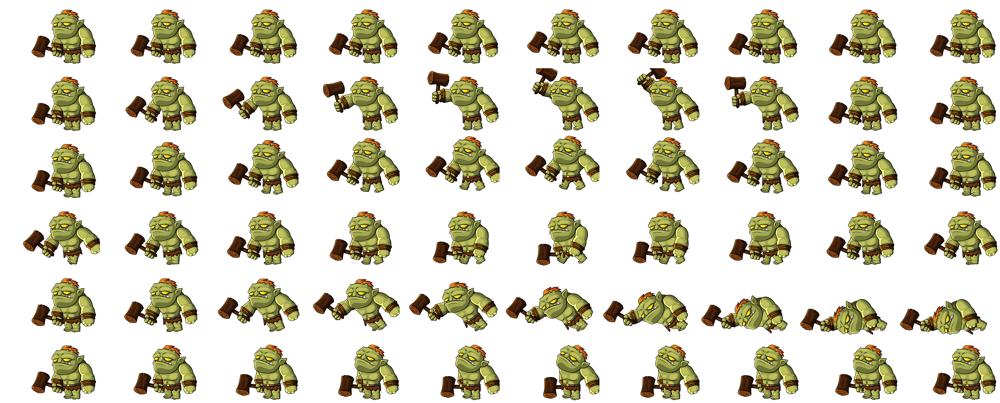

# Calling Out For A Hero - Front End
[description]

## Libraries used
* [React Responsive Spritesheet](https://github.com/danilosetra/react-responsive-spritesheet)
* [React Countdown Circle Timer](https://github.com/vydimitrov/react-countdown-circle-timer/tree/master/packages/web#react-countdown-circle-timer)
* [ReactPlayer](https://github.com/CookPete/react-player)

## Spritesheet Component Set Up
 This component is found within **/src/spriteAndClocks/spriteContainer.jsx** and uses the [React Responsive Spritesheet](https://github.com/danilosetra/react-responsive-spritesheet) to animate sprites. Please refer to the official documentation for React Responsive Spritesheet for functions specific to that component. The component default name is **\<SpriteContainer />** But for this component, there are few things to highlight so it can work as intended

### Sprite Sheet Specifications
The spritesheet document needs to be formatted in the following way.
* For the purpose of spritesheet, it should be as a PNG file. It having transparency and layers should be the point. It should look at follows
    
* 
 Each frame of the animations should be separated by equal lengths. Something like [this sprite generator](https://spritegen.website-performance.org/) should help make a sheet of equal distance. try to make the distance between be 0.
* The "actions" & frames for each spritesheet should be organized in the following order
    

    1. idle(default actions)
    2. attack
    3. jump
    4. run
    5. die
    6. hurt
    

    The spritesheet does not necessarily need to have all of the actions present, but if you jump over a action but need one further in the list, it will better practice to include a blank set of frames to keep the action descriptions relevent. Best practice is to have the sprite sheet be complete with all actions though. **The actions should have the same amount of frames as all the other actions.

* The sprite given to the component with the following props

 > **url** - url for the spritesheet
 >
 > **height** - the height of the sprite frame. Not the height of the sprite sheet
 >
 > **width** - the width of the sprite frame. Not the width of the sprite sheet
 >
 > **steps** - how many frames are in the actions

### Sprite Sheet Component Additional Props
In addition to the sprite props mentioned above, the **\<SpriteContainer />** should be given the following props.

| props      | default  | purpose                                                                                                                                                                                             |
|------------|----------|-----------------------------------------------------------------------------------------------------------------------------------------------------------------------------------------------------|
| divName    | ""       | This is the css class name you want give to the parent div containing the sprite component.                                                                                                         |
| styling    | "sprite" | This is the css class name you want to give to the React Responsive Spritesheet component. Refer to the official documentation for that sprite to find out more on its effects.                     |
| status     | "idle"   | This is the initial behavior/action you want the sprite to take. The will determine which functions/attributes the sprite will take during animation. The list of acceptable actions listed below.  |
| changeHero | (none)   | This should be the callback function passed into the component that allows the component to talk to it's sibling sprites. This is currently only being required for the **enemy** status            |

### Spritesheet Actions & Functions

**\<SpriteContainer />** uses the **status** prop given to take advantage of React Responsive Spritesheet properties to automate a few actions. Specifically the **OnMouseEnter**, **OnMouseLeave**, **OnLoopComplete**.

The following are the current acceptable status props that can be passed down
| **status** | **onMouseEnter()**                                                | **onMouseLeave()**                | **onLoopComplete()**                                                                                                                                                                                                                                                      |
|------------|-------------------------------------------------------------------|-----------------------------------|---------------------------------------------------------------------------------------------------------------------------------------------------------------------------------------------------------------------------------------------------------------------------|
| idle       | go to the sprites "jump" animation                                | return to initial animation state | nothing                                                                                                                                                                                                                                                                   |
| attack     | go to the sprites "hurt" animation                                | return to initial animation state | loop through initial animation                                                                                                                                                                                                                                            |
| running    | nothing                                                           | return to initial animation state | nothing                                                                                                                                                                                                                                                                   |
| enemy      | nothing                                                           | return to initial animation state | **SPECIAL**  calls **determiningLocation()** which currently moves the sprite's location on the parent container. Depending on it's location, it will continue it's animation, or it will execute the passed down **changeHero** prop and change it's animation to "hurt" |
| demoHero   | go to the sprites "attack" animation                              | return to initial animation state | nothing                                                                                                                                                                                                                                                                   |
| demoEnemy  | go to the sprites" attack" animation followed by "jump animation" | return to initial animation state | nothing                                                                                                                                                                                                                                                                   |
| shopper    | nothing                                                           | return to initial animation state | nothing                                                                                                                                                                                                                                                                   |
| cofah      | nothing                                                           | nothing                           | calls **cofahrun()** which move the sprite's location in the parent container or go through the"jump" animation                                                                                                                                                           |
| rescue     | nothing                                                           | nothing                           | nothing                                                                                                                                                                                                                                                                   |

This project was bootstrapped with [Create React App](https://github.com/facebook/create-react-app).

## Available Scripts

In the project directory, you can run:

### `npm start`

Runs the app in the development mode. 
Open [http://localhost:3000](http://localhost:3000) to view it in the browser.

The page will reload if you make edits. 
You will also see any lint errors in the console.

### `npm test`

Launches the test runner in the interactive watch mode. 
See the section about [running tests](https://facebook.github.io/create-react-app/docs/running-tests) for more information.

### `npm run build`

Builds the app for production to the `build` folder. 
It correctly bundles React in production mode and optimizes the build for the best performance.

The build is minified and the filenames include the hashes. 
Your app is ready to be deployed!

See the section about [deployment](https://facebook.github.io/create-react-app/docs/deployment) for more information.

### `npm run eject`

**Note: this is a one-way operation. Once you `eject`, you can’t go back!**

If you aren’t satisfied with the build tool and configuration choices, you can `eject` at any time. This command will remove the single build dependency from your project.

Instead, it will copy all the configuration files and the transitive dependencies (webpack, Babel, ESLint, etc) right into your project so you have full control over them. All of the commands except `eject` will still work, but they will point to the copied scripts so you can tweak them. At this point you’re on your own.

You don’t have to ever use `eject`. The curated feature set is suitable for small and middle deployments, and you shouldn’t feel obligated to use this feature. However we understand that this tool wouldn’t be useful if you couldn’t customize it when you are ready for it.

## Learn More

You can learn more in the [Create React App documentation](https://facebook.github.io/create-react-app/docs/getting-started).

To learn React, check out the [React documentation](https://reactjs.org/).

### Code Splitting

This section has moved here: https://facebook.github.io/create-react-app/docs/code-splitting

### Analyzing the Bundle Size

This section has moved here: https://facebook.github.io/create-react-app/docs/analyzing-the-bundle-size

### Making a Progressive Web App

This section has moved here: https://facebook.github.io/create-react-app/docs/making-a-progressive-web-app

### Advanced Configuration

This section has moved here: https://facebook.github.io/create-react-app/docs/advanced-configuration

### Deployment

This section has moved here: https://facebook.github.io/create-react-app/docs/deployment

### `npm run build` fails to minify

This section has moved here: https://facebook.github.io/create-react-app/docs/troubleshooting#npm-run-build-fails-to-minify
# Calling_Out_For_A_Hero_Frontend
